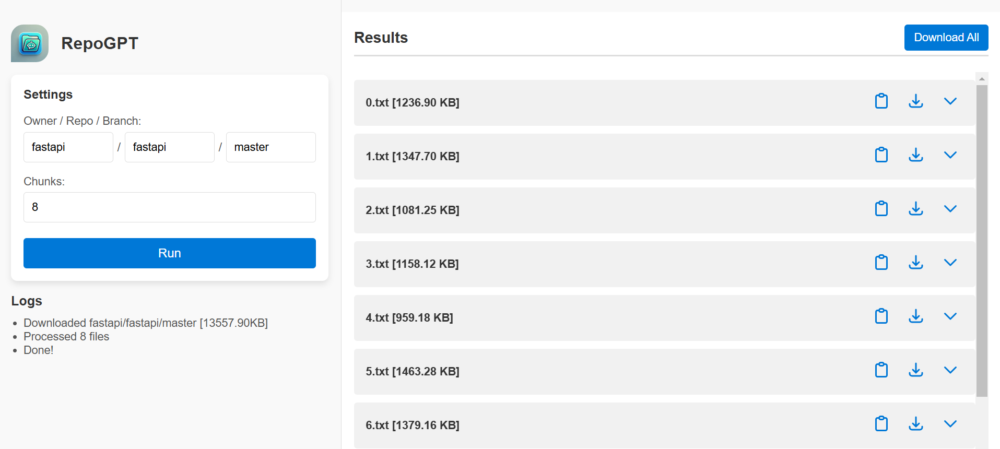

# RepoGPT

> Create custom GPTs from your GitHub repositories

### Chrome Extension

## Site: Concatenate Repos

Donwloads your repository and concatenates files into a (customizable) number of chunks, ready to give as context to a custom GPT.

[>>> LINK <<<](https://repogpt.marcelc.uk)

